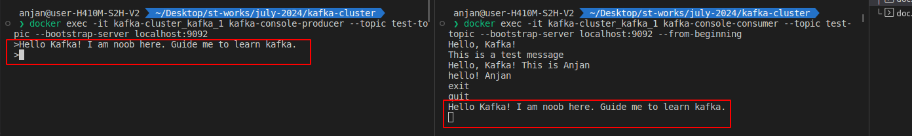

# Docker Compose for Apache Kafka and Zookeeper

This repository contains a Docker Compose setup for running Apache Kafka and Zookeeper services along with Kafka Producer and Kafka Consumer services. The services are configured to work together within a Docker network named `kafka-net`.

## Services

1. **Zookeeper**: Manages and coordinates Kafka brokers.
2. **Kafka**: The main Kafka broker service.
3. **Kafka Producer**: A Kafka broker acting as a producer.
4. **Kafka Consumer**: A Kafka broker acting as a consumer.

## Prerequisites

- Docker
- Docker Compose

## Usage

### Clone the Repository

```sh
git clone <repository_url>
cd <repository_directory>

```

### Start the Services
To start the services, run:
```sh
docker-compose up -d
```
This command will start all the services in detached mode.

### Stop the Services
To stop the services, run:
```sh
docker-compose down
```

### Service Details
#### Zookeeper
1. **Image**: confluentinc/cp-zookeeper:latest
2. **Ports**: 2181
3. **Environment Variables**:
4. **ZOOKEEPER_CLIENT_PORT**: 2181
5. **ZOOKEEPER_TICK_TIME**: 2000


## Kafka Service

- **Image**: `confluentinc/cp-kafka:latest`
- **Ports**: 
  - `9092` (internal Kafka communication)
  - `29092` (external Kafka communication)

### Environment Variables

- `KAFKA_BROKER_ID`: `1`
- `KAFKA_ZOOKEEPER_CONNECT`: `zookeeper:2181`
- `KAFKA_ADVERTISED_LISTENERS`: `PLAINTEXT://kafka:9092,PLAINTEXT_HOST://localhost:29092`
- `KAFKA_LISTENER_SECURITY_PROTOCOL_MAP`: `PLAINTEXT:PLAINTEXT,PLAINTEXT_HOST:PLAINTEXT`
- `KAFKA_INTER_BROKER_LISTENER_NAME`: `PLAINTEXT`
- `KAFKA_OFFSETS_TOPIC_REPLICATION_FACTOR`: `1`

## Kafka Producer Service

- **Image**: `confluentinc/cp-kafka:latest`
- **Ports**:
  - `9093` (internal Kafka producer communication)
  - `29093` (external Kafka producer communication)

### Environment Variables

- `KAFKA_BROKER_ID`: `2`
- `KAFKA_ZOOKEEPER_CONNECT`: `zookeeper:2181`
- `KAFKA_ADVERTISED_LISTENERS`: `PLAINTEXT://kafka-producer:9093,PLAINTEXT_HOST://localhost:29093`
- `KAFKA_LISTENER_SECURITY_PROTOCOL_MAP`: `PLAINTEXT:PLAINTEXT,PLAINTEXT_HOST:PLAINTEXT`
- `KAFKA_INTER_BROKER_LISTENER_NAME`: `PLAINTEXT`
- `KAFKA_OFFSETS_TOPIC_REPLICATION_FACTOR`: `1`

## Kafka Consumer Service

- **Image**: `confluentinc/cp-kafka:latest`
- **Ports**:
  - `9094` (internal Kafka consumer communication)
  - `29094` (external Kafka consumer communication)

### Environment Variables

- `KAFKA_BROKER_ID`: `3`
- `KAFKA_ZOOKEEPER_CONNECT`: `zookeeper:2181`
- `KAFKA_ADVERTISED_LISTENERS`: `PLAINTEXT://kafka-consumer:9094,PLAINTEXT_HOST://localhost:29094`
- `KAFKA_LISTENER_SECURITY_PROTOCOL_MAP`: `PLAINTEXT:PLAINTEXT,PLAINTEXT_HOST:PLAINTEXT`
- `KAFKA_INTER_BROKER_LISTENER_NAME`: `PLAINTEXT`
- `KAFKA_OFFSETS_TOPIC_REPLICATION_FACTOR`: `1`

## Testing
To test the setup, you can use Kafka command-line tools to produce and consume messages.
```sh
docker exec -it kafka-cluster_kafka_1 kafka-topics --create --topic test-topic --bootstrap-server localhost:9092 --partitions 1 --replication-factor 1
```

### Produce a Message
```sh
docker exec -it kafka-cluster_kafka_1 kafka-console-producer --topic test-topic --bootstrap-server localhost:9092
```
### Consume a Message
```sh
docker exec -it kafka-cluster_kafka_1 kafka-console-consumer --topic test-topic --bootstrap-server localhost:9092 --from-beginning
```
### Output
